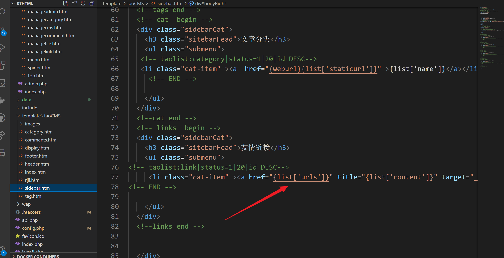
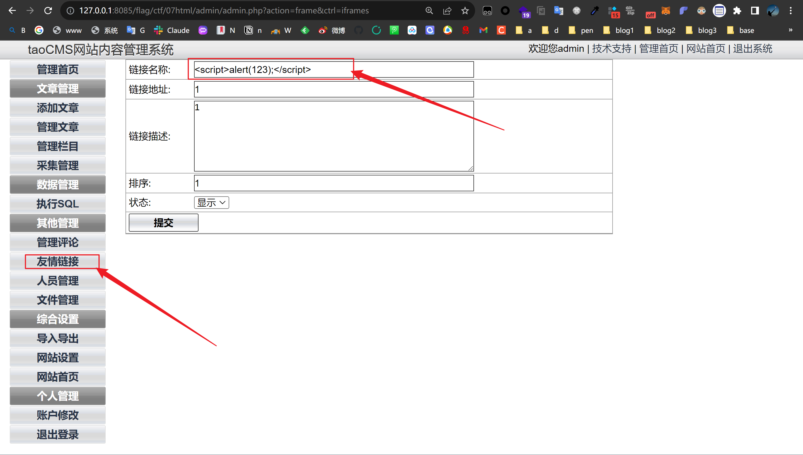
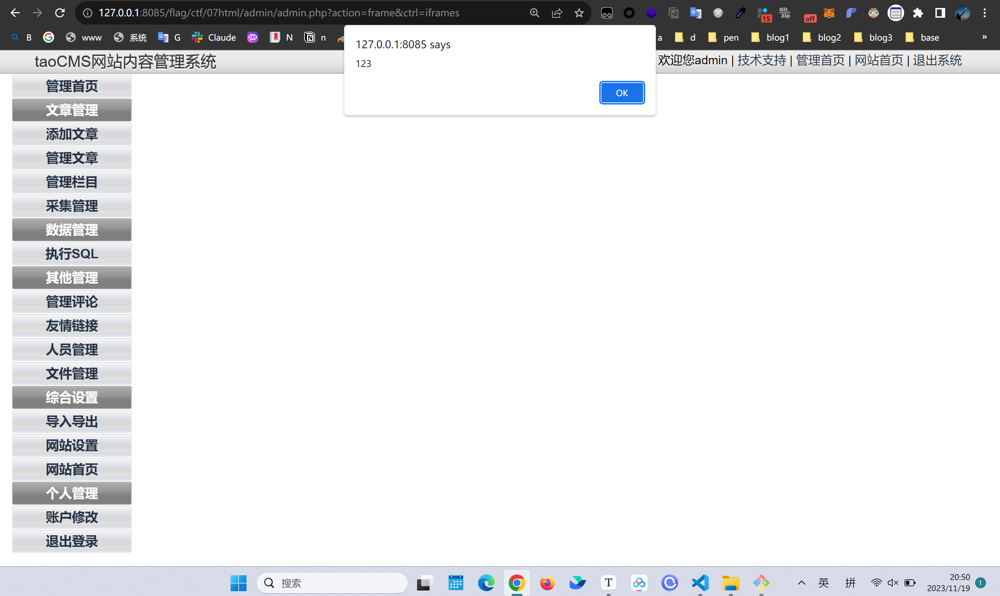
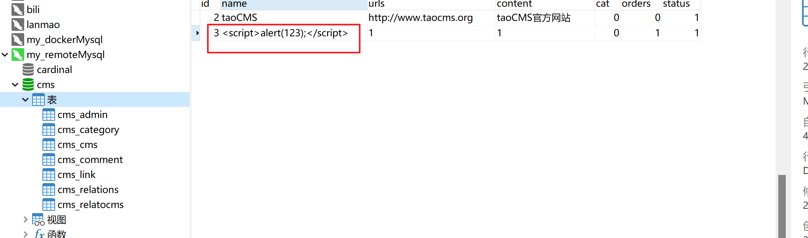
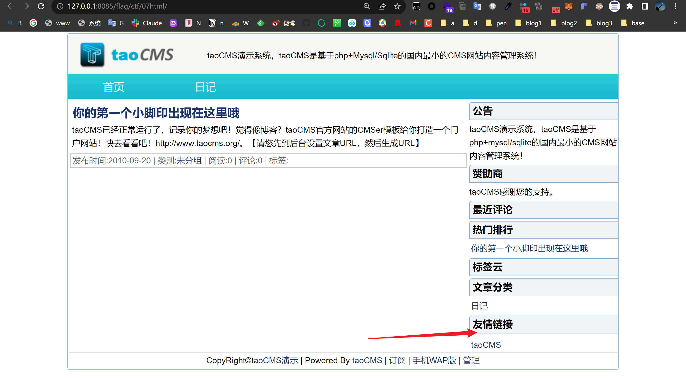
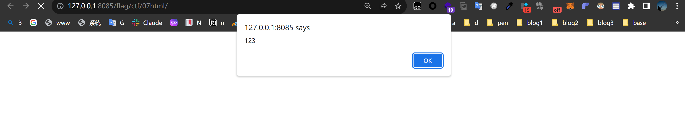

There is a stored cross-site scripting attack in "Friendly Links" (column administrator rights)

Click "Friendly Links" to add content

You can see that the data is written to the database without filtering and escaping.Therefore, a stored XSS vulnerability exists.

On the homepage of the website, the link content is output without escaping or filtering, and you can see that the javascript code is successfully executed.

